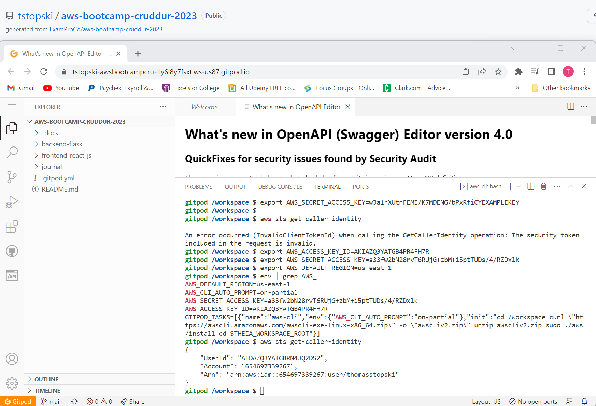

# Week 0 — Billing and Architecture

## Required Homework/Tasks

### 1. Watch all Videos for Week 0

I was able to watch all the videos created for Week 0. This was time-consuming but I am new to some of the tools we are using so the videos were extremely helpful.

### 2. Recreate Conceptual Diagram in Lucid Charts or on a Napkin

I chose to draw the conceptual diagram on a napkin from Starbucks so I felt like a true visionary. That said, I still need to do some more research on the inner-workings
of what was truly captured on my napkin. I guess this means I need to commit more time to research. Below is a photo of my conceptual drawing for proof of completion:

** Insert Napkin Photo Here **

### 3. Recreate Logical Architectual Diagram in Lucid Charts

This is the first time I have used Lucid Charts for diagrams. Below is a screenshot of my final logical architecture diagram:

** Insert Cruddur logical photo here **

### 4. Create Admin User, Use Cloudshell, Generate AWS Credentials

I know that based on Andrew Brown's YouTube video, Updating Your Journal in Github, I do not need to provide proof for these three items. I still wanted to capture
completion of each task in my Week 0 Journal. Since I already had an 'Admin' account in AWS from a previous course, I created another account just for this bootcamp
with admin priveleges. I also watch the video for AWS Cloudshell that Andrew posted and leveraged the us-east-1 region. I was also able to generate AWS Credentials
for my newly created admin account along with enabling MFA as recommended by both Andrew and Ashish.

### 5. Installed and Verified AWS CLI

I was able to use Gitpod to install AWS CLI. I have added the verification photo below and you can also check my updated .yml file in the 'main' branch. 

### 6. Create Billing Alarm, Create Budget

I watched the videos that both Chirag and Andrew posted on the ExamPro youtube channel. Andrew's video for budgets was much more in-depth and helpful. I captured a
screenshot of my budgets just in case it was needed for homework verification. See below:

** insert budget photo here**

## Homework Challenges
